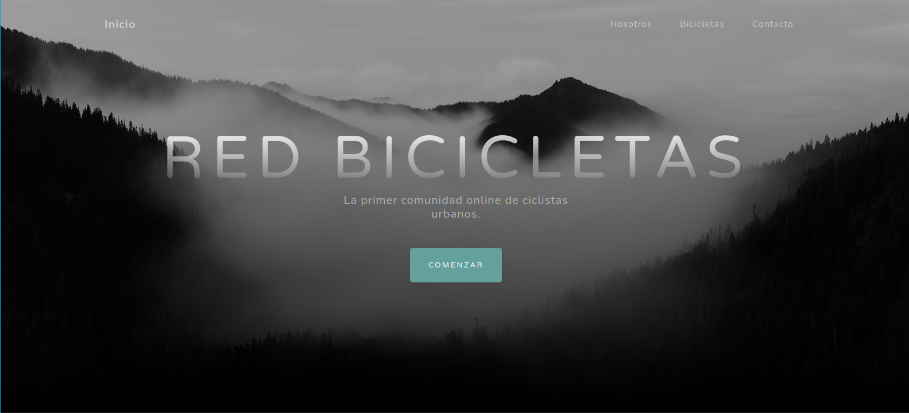
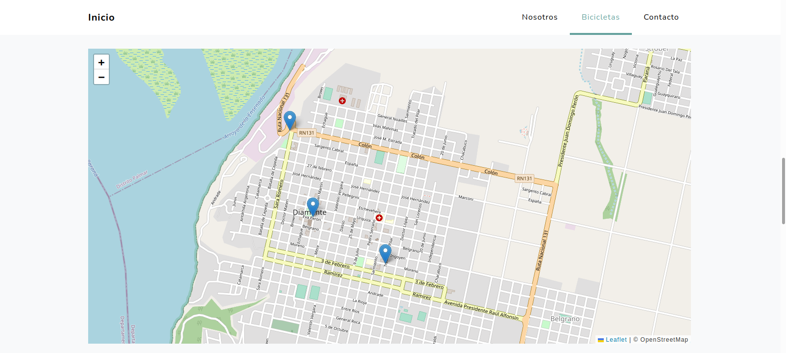
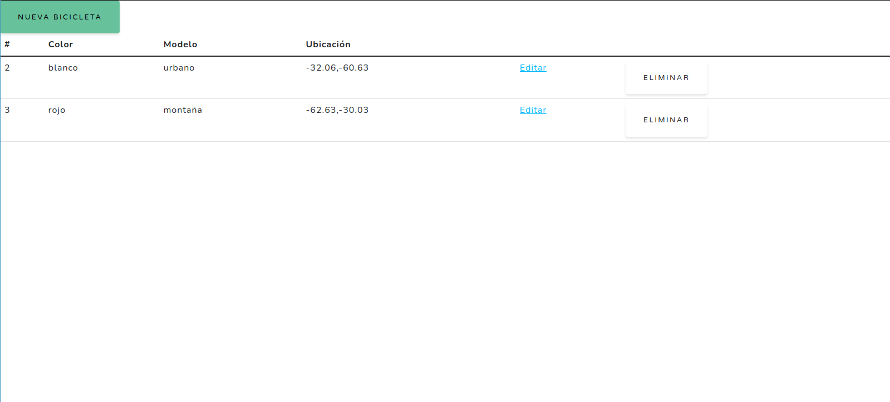

# Red de bicicletas

## Requisitos
* NodeJs
* MongoDB

## Instalación
```
git clone https://github.com/anakloss/red_bicicletas.git
cd red_bicicletas
npm install
npm run devstart
```

## Descripción
Creación de una red de bicicletas.
Proyecto web realizado para el curso "Desarrollo del lado servidor: NodeJS, Express y MongoDB" de Coursera.

### Inicio
Página de Inicio, descripción Sobre nosotros y Contacto.


### API Bikes
API para creación, modificación y eliminación de bicicletas.

### Autenticación
Login y register utilizando la cuenta de Google o email.
